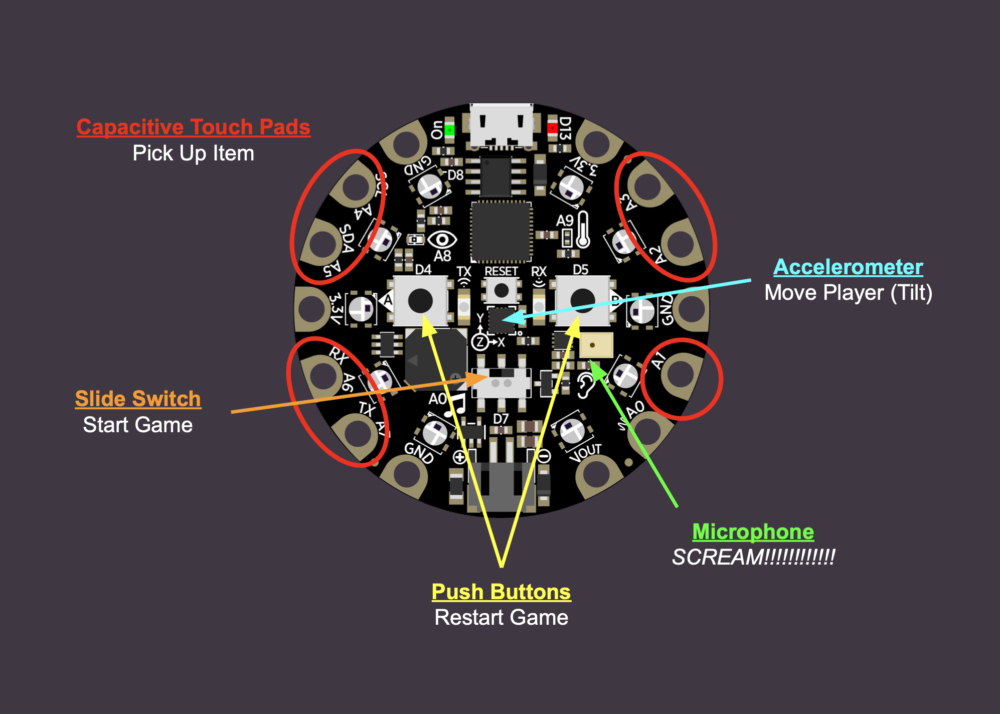
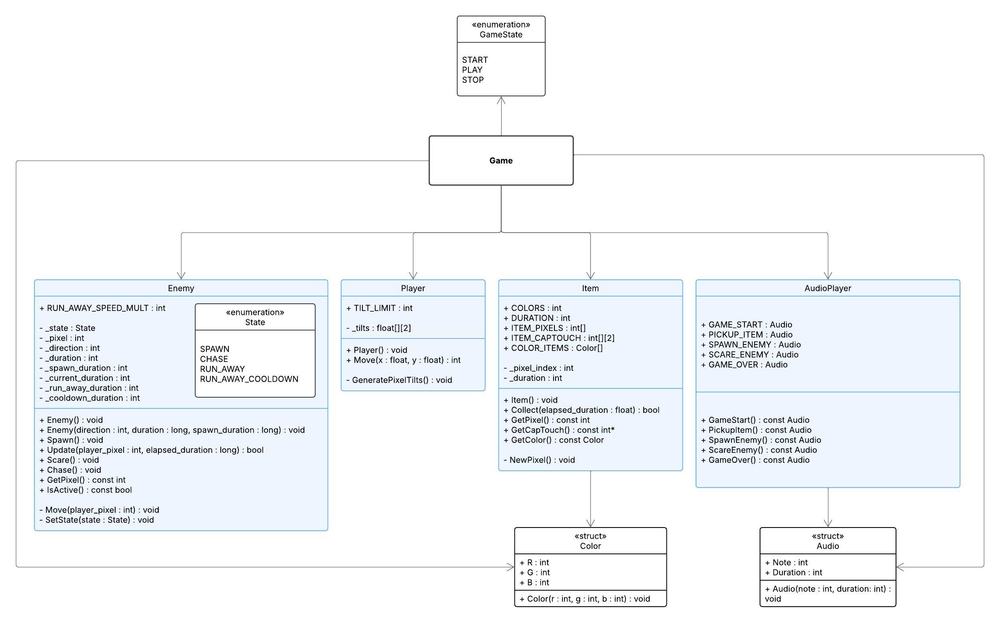

# CPX NeoPixel Tag
A fast-paced, tilt-controlled game of tag built for the Adafruit Circuit Playground Express using the Arduino IDE. Collect as many items as you can while evading enemies and scaring them away with your voice!

### Video Demo

https://github.com/user-attachments/assets/77ee8a3e-51d4-4acc-8ba9-bcf733138853

## Controls
### Overview
- <b>Slide Switch :</b> Start
- <b>Tilt Board :</b> Move Player
- <b>Touch Pads :</b> Pick Up Items
- <b>Microphone :</b> Scare Enemies (by <b><i>SCREAMING!!!!!!!!</i></b>)
- <b>Push Buttons :</b> Restart

### Visualization

## File Hierarchy
- `Game.ino`: Main Arduino script written in C that handles hardware sensor input from the CPX and the overall gameplay state and logic.
- `Game.h`: Header file that initializes `enum GameState`, `struct Color`, and numerous constants used across multiple scripts.
- `Player.h` / `Player.cpp`: Handle player movement based on acceleration data from the accelerometer.
- `Enemy.h` / `Enemy.cpp`: Handle enemy movement and AI using a FSM.
- `Item.h` / `Item.cpp`: Handles item pickup and regeneration based on player input from the capacitative touch pads.
- `Audio.h` / `Audio.cpp`: Stores and returns SFXs associated with specific game interactions.

